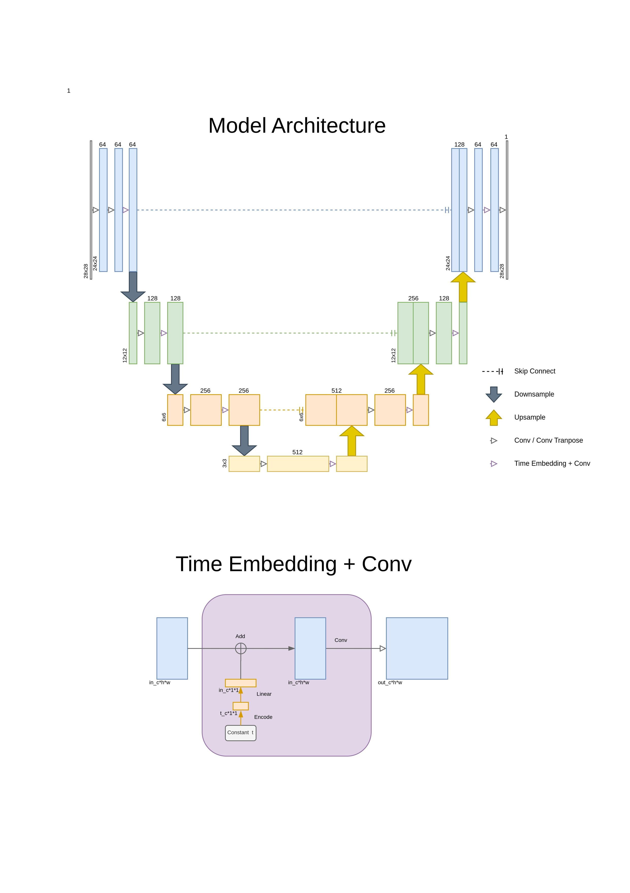

# DDPM Implementation (Experiment Branch)

My DDPM (Denoising Diffusion Probabilistic Model) implementation using PyTorch.

This project is developing... Just wait for that. 🤫

---

Original research paper: https://arxiv.org/pdf/2006.11239 (_Denoising Diffusion Probabilistic Models_)

Dataset from kaggle: https://www.kaggle.com/datasets/splcher/animefacedataset

---

## Experiment

### Model Architecture

The time encode, which was appeared in the second figure, is basically same to the Position Encoding in Tranformer.

### DDPM Hyperparameters

In order to simplify this experiment, I set:

Max time step `T = 100`.

Beta_t increasing linearly from `beta_1 = 1e-3` to `beta = 0.15`.

### Dataset

I use MNIST dataset to train my model.
